# コンポーネント依存関係分析

## 生成日時
- 日時: 2026-03-10 12:00:00 JST
- 分析対象: GakuseAI/Views/Components/*.swift

---

## 依存関係グラフ

```mermaid
graph TD
    AccordionView --> AccordionItemView
    AccordionView --> SimpleAccordionView
    BreadcrumbView --> SimpleBreadcrumbView
    CarouselView --> SimpleCarouselView
    CarouselView --> TabView
    CheckboxView --> CheckboxGroupView
    CheckboxView --> CheckboxLabelView
    CheckboxView --> DividerView
    ColorPickerView --> CompactColorPickerView
    DatePickerView --> DateRangePickerView
    DividerView --> SectionDividerView
    DividerView --> VerticalDividerView
    ErrorView --> EmptyStateView
    ErrorView --> AuthenticationErrorView
    ErrorView --> NetworkErrorView
    FormView --> FormField
    FormView --> SimpleFormView
    FormView --> InlineFormView
    FormView --> GroupedFormView
    GridView --> SimpleGridView
    GridView --> AdaptiveGridView
    LinearProgressView --> SimpleLinearProgressView
    LinearProgressView --> LabeledLinearProgressView
    LinearProgressView --> AnimatedLinearProgressView
    LinearProgressView --> SteppedLinearProgressView
    LinearProgressView --> MultiColorLinearProgressView
    ListView --> SimpleListView
    ListView --> CardListView
    ListView --> GroupedListView
    LoadingView --> SkeletonLoadingView
    ModalView --> SimpleModalView
    ModalView --> AlertModalView
    OnboardingView --> SimpleOnboardingView
    OnboardingView --> TabView
    PaginationView --> SimplePaginationView
    PullToRefreshView --> SimplePullToRefreshView
    PullToRefreshView --> AvatarView
    PullToRefreshView --> CardView
    PullToRefreshView --> DividerView
    PullToRefreshView --> SpinnerView
    RadioButtonView --> RadioButtonGroupView
    RadioButtonView --> RadioButtonLabelView
    RadioButtonView --> DividerView
    RatingView --> StarRatingView
    RatingView --> EmojiRatingView
    RatingView --> HeartRatingView
    RatingView --> ThumbRatingView
    RatingView --> RatingStar
    SectionHeaderView --> SimpleSectionHeaderView
    SectionHeaderView --> IconSectionHeaderView
    SectionHeaderView --> ActionSectionHeaderView
    SegmentedProgressView --> SimpleSegmentedProgressView
    SegmentedProgressView --> HorizontalSegmentedProgressView
    SelectView --> SimpleSelectView
    SelectView --> DropdownSelectView
    SelectView --> RadioSelectView
    SelectView --> CardSelectView
    SliderView --> LabeledSliderView
    SliderView --> RangeSliderView
    SliderView --> DividerView
    SpinnerView --> BarSpinnerView
    SpinnerView --> DotsSpinnerView
    SpinnerView --> PulseSpinnerView
    StepperView --> LabeledStepperView
    StepperView --> SimpleStepperView
    TabView --> SimpleTabView
    TagView --> TagGroupView
    TimelineView --> SimpleTimelineView
    TimelineView --> TimelineItemView
    TimelineView --> ProgressTimelineView
    TimelineView --> ActivityTimelineView
    ToastView --> SimpleToastView
    ToastView --> ToastContainerView
```

---

## 再利用性分析

### 高再利用性コンポーネント（★★★★★）
以下のコンポーネントは他のコンポーネントに依存せず、再利用性が高い:

1. **ActionBar** - アクションバー
2. **AnimatedButton** - アニメーション付きボタン
3. **AvatarGroup** - アバターグループ
4. **NotificationCard** - 通知カード
5. **ProfileCard** - プロフィールカード
6. **ProgressRing** - 円形プログレス
7. **SearchBar** - 検索バー
8. **SegmentedControl** - セグメントコントロール
9. **Slider** - スライダー
10. **Stepper** - ステッパー
11. **TextInputField** - テキスト入力フィールド
12. **Toast** - トースト通知
13. **ToggleSwitch** - トグルスイッチ

### 中再利用性コンポーネント（★★★★☆）
以下のコンポーネントは1-2個の依存を持つ:

1. **AvatarView** - アバター
2. **BadgeView** - バッジ
3. **CardView** - カード
4. **DividerView** - 区切り線
5. **EmptyStateView** - 空状態
6. **LinearProgressView** - リニアプログレス
7. **RatingStar** - 評価星
8. **SegmentedProgressView** - セグメントプログレス
9. **SkeletonView** - スケルトン
10. **StepperView** - ステッパービュー
11. **SwipeActionView** - スワイプアクション
12. **TabBar** - タブバー
13. **TagView** - タグ
14. **TimelineView** - タイムライン
15. **ToastView** - トーストビュー
16. **TooltipView** - ツールチップ

---

## 依存関係最適化の検討

### 1. 再利用性向上の推奨事項
- **AccordionView**、**CarouselView**、**CheckboxView**などは多くの内部依存を持つ
- これらのコンポーネントをモジュール化し、サブコンポーネントとして独立させることで再利用性を向上できる

### 2. 循環依存の回避
- 現在、循環依存は確認されていない
- 将来的な拡張時には、依存関係の可視化を継続して監視する

### 3. 依存関係の簡素化
- **PullToRefreshView**は多くのコンポーネントに依存している
- **FormView**、**ListView**、**SelectView**などは内部サブコンポーネントを持つため、モジュール化を検討
- 必要最小限の依存に絞ることで、メンテナンス性を向上させる

---

## コンポーネント数の推移

- **総コンポーネント数**: 58件
- **高再利用性（★★★★★）**: 13件
- **中再利用性（★★★★☆）**: 16件
- **その他**: 29件

---

## 新規追加コンポーネント（12時タスク）

1. **FormView** - フォームコンポーネント（4種類のスタイル、バリデーション対応）
2. **ListView** - リストビューコンポーネント（6種類のスタイル）
3. **SelectView** - 選択コンポーネント（6種類のスタイル）
4. **StepperView** - ステッパーコンポーネント（4種類のスタイル）
5. **SegmentedProgressView** - セグメントプログレスコンポーネント（4種類のスタイル）
6. **LinearProgressView** - リニアプログレスコンポーネント（6種類のスタイル）

---

## 次回のアクション

1. 低再利用性コンポーネントのリファクタリング
2. 依存関係の削減
3. 共通コンポーネントの抽出
